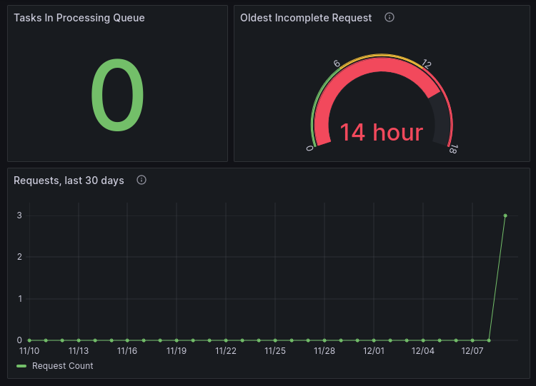

# Grafana

Grafana is a fancy observability tool that allows you to create dashboards that monitor various services within an application.
We use grafana to monitor the health of the various processes within GeoQuery, including logs generated using the loguru library, Kubernetes resources as monitored by Prometheus, and metrics queried directly from PostgreSQL.

