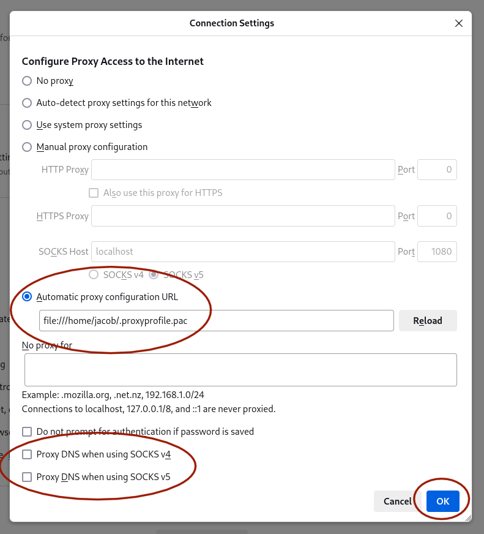

# Argo CD

This guide will walk you through interacting with the kubernetes cluster through our [Argo CD](https://argoproj.github.io/cd/) dashboard. To learn more about Argo CD refer to the [Argo CD documentation](https://argo-cd.readthedocs.io/en/stable/).

## Setting up the proxy

We recommend using Mozilla Firefox as the internet browser to access the dashboard through, as these instructions apply specifically to setting up the proxy on Mozilla Firefox.

1. Save the following code to `~/.proxyprofile.pac`:
```
function FindProxyForURL(url, host) {
    if (shExpMatch(host, "*.nova.sciclone.wm.edu")) {
        return "SOCKS localhost:1080";
    }
}
```
2. Adjust the network settings in Firefox to look like so (see image below), **adjusting the file:/// path to reflect your home directory's location**


Now, Firefox works no matter what, and most any traffic not passed through the proxy at all. If the URL ends with `.nova.sciclone.wm.edu`, however, Firefox will insist on pushing it through the SOCKS proxy on port 1080. This will only succeed, of course, if you have the proxy live using the SSH command listed above.

## Accessing the Dashboard
